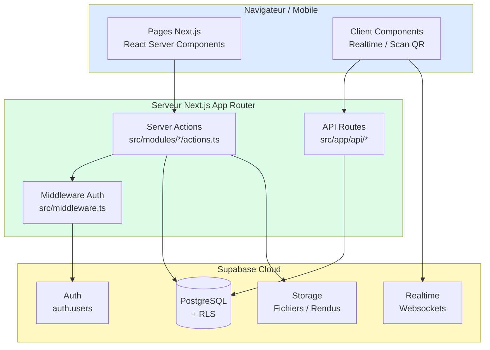
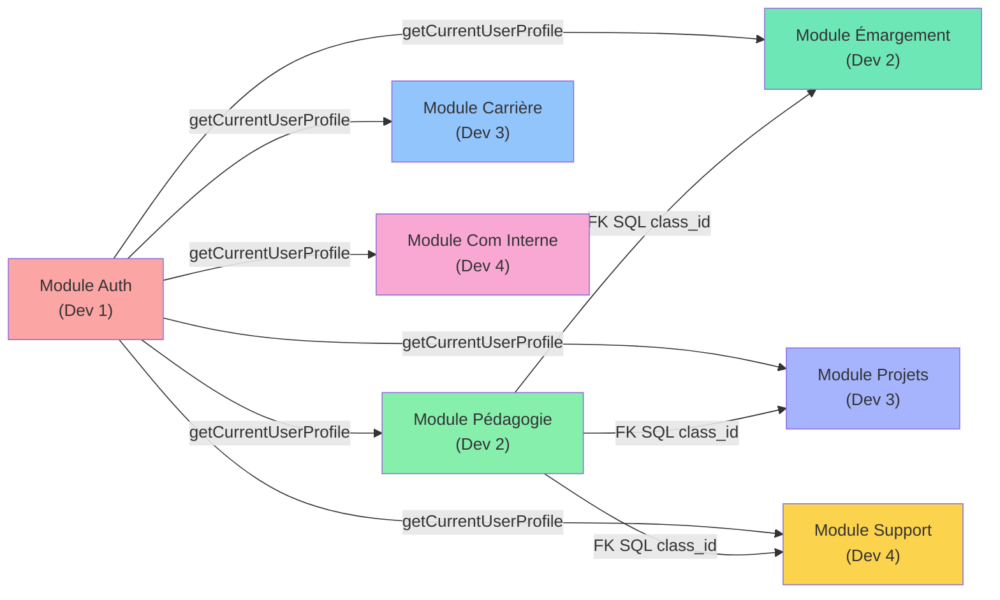
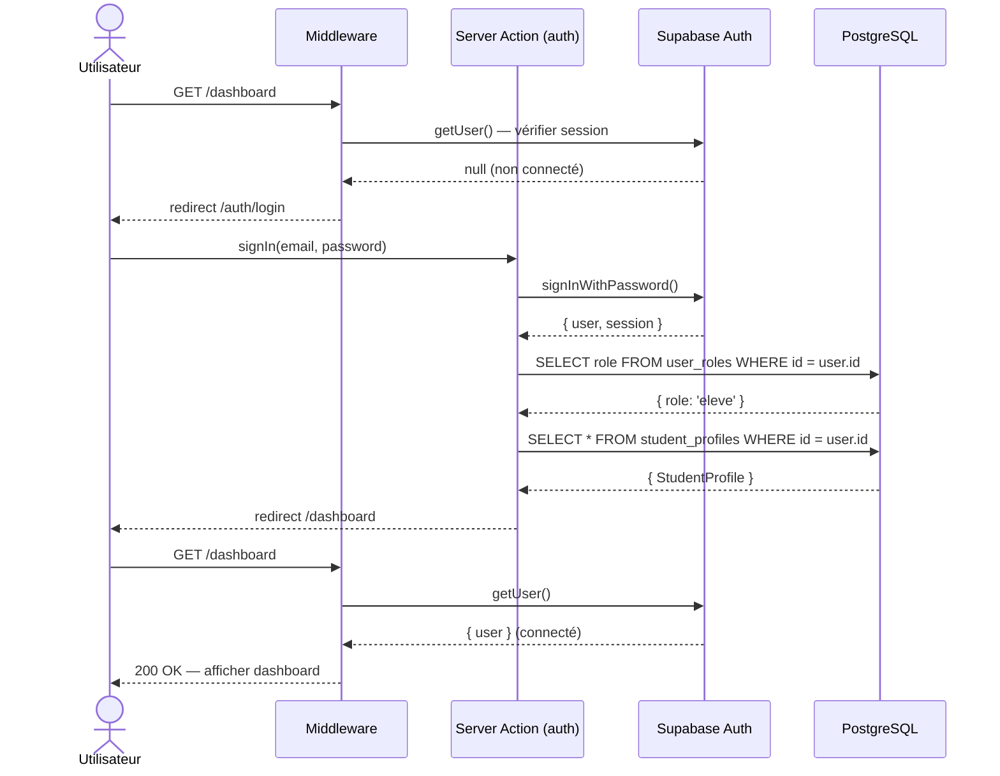
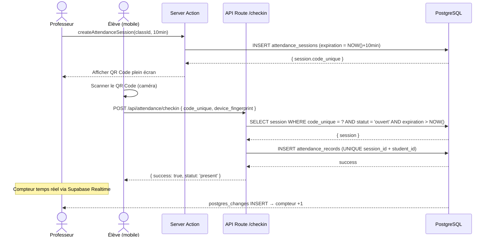
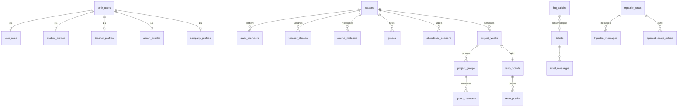

# Architecture Technique — Hub École

**Ref :** US10, US11, US12

---

## 1. Justification de la stack (US11)

| Critère | Next.js 16 | Supabase | Tailwind CSS v4 | Docker |
|---------|-----------|----------|-----------------|--------|
| Rapidité d'apprentissage | ✅ React connu de l'équipe | ✅ Interface Studio intuitive | ✅ Utility-first, pas de CSS à écrire | ✅ Standard industrie |
| Maintenabilité | ✅ App Router = structure claire | ✅ RLS = sécurité déclarative | ✅ Classes lisibles | ✅ Environnement reproductible |
| Déploiement | ✅ Vercel ou Docker | ✅ Cloud managé | — | ✅ Portable partout |
| Sécurité | ✅ Server Actions (pas d'API exposée) | ✅ RLS natif PostgreSQL | — | ✅ User non-root |
| Alternatives écartées | Remix (moins mature), SvelteKit (courbe d'apprentissage) | Firebase (NoSQL = schéma flou), PocketBase (communauté plus petite) | MUI (trop lourd), CSS Modules (verbeux) | — |

---

## 2. Architecture globale (US10)

### Responsabilités des blocs

| Bloc | Responsabilité | Ne fait PAS |
|------|---------------|-------------|
| **Pages (RSC)** | Fetch des données, rendu HTML initial | Logique métier, appels directs à la DB |
| **Server Actions** | Logique métier, validation, accès DB | Rendu UI |
| **Middleware** | Vérification session auth sur chaque requête | Logique métier |
| **Client Components** | Interactivité, Realtime, caméra QR | Accès direct à la DB |
| **API Routes** | Endpoints mobiles (scan QR) | Pages ou navigation |
| **Supabase RLS** | Sécurité des données à la source | Logique applicative |

---

## 3. Séparation des modules (anti-collision)

**Règle :** Les flèches pleines = seul export de code autorisé (`getCurrentUserProfile`). Les flèches SQL = clés étrangères en base uniquement, pas d'import de code.

---

## 4. Diagramme de séquence — Connexion et routage (US12)

---

## 5. Diagramme de séquence — Scan QR Émargement (US12)

---

## 6. Modèle de données simplifié

